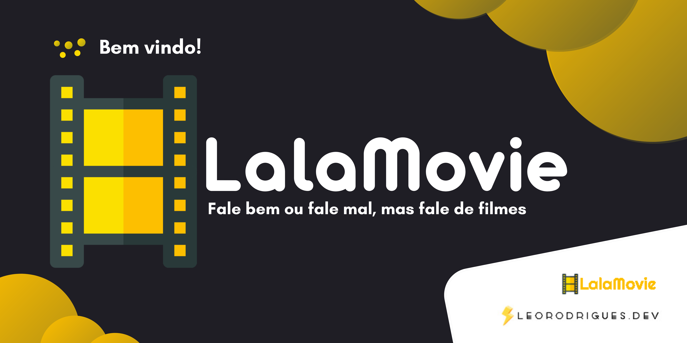

<p align="center" >

</p>


<h1 align="center">
     LalaMovie
</h1>
<p align="center">🎬 Aplicação para críticas e comentários de filmes </p>


\
\
[](https://github.com/)
[](https://code.visualstudio.com/)
[](https://www.typescriptlang.org/)
[](https://www.figma.com/)
[](https://github.com/ellerbrock/open-source-badges/)

<a href="https://www.reactnative.dev/">
</a>


Guia
=================
<!--ts-->
   * [Sobre](#Sobre)
   * [Status do Projeto](#Status-do-projeto)
   * [Features](#Features)
   * [Pré-requisitos](#Pre-requisitos)
   * [Rodando a aplicação](#Rodando-a-aplicação)
   * [Tecnologias](#Tecnologias)
   * [Autor](#Autor)
<!--te-->

## Sobre

Projeto de estudo, idealizado com o objetivo de aprender na prática React Native e preparando a aspirante e dev jr.


## Status do Projeto

<h4 align="center"> 
	🚧  LalaMovie 🚩 Em construção...  🚧
</h4>


<p align="center" >
<a href="https://www.figma.com/file/WOgzQRVuJdzEapKKlwCRrd/LalaMovie"></a>
</p>


## Features


- [x] Designer do projeto no Figma
- [x] Criar projeto com CLI react native em JS
- [x] Page Home
- [x] Header
- [x] Slider
- [x] Card
- [x] Top Rated
- [x] Lowest Rated
- [x] Navigation
- [ ] Page Movie

    . . .

---
<p align="center">

  

  

</p>


## Pré-requisitos

Antes de começar, você vai precisar ter instalado em sua máquina as seguintes ferramentas:
[Git](https://git-scm.com), [Node.js](https://nodejs.org/en/). 
Além disto é bom ter um editor para trabalhar com o código como [VSCode](https://code.visualstudio.com/)

## 🎲 Rodando a aplicação

```bash
# Clone este repositório
$ git clone https://github.ibm.com/leonardo-rodrigues/lalamovie.git

# Acesse a pasta do projeto no terminal/cmd
$ cd lalamovie

# Instale as dependências
$ yarn install

# Execute a aplicação em modo de desenvolvimento no emulador android ( Dica: Deixar o emulador aberto antes deste comando )
$ yarn android

# Execute a aplicação em modo de desenvolvimento no emulador ios
$ yanr ios

# A aplicação inciará de form automática após o comando em qualquer uma das três opções.
```
## 🛠 Tecnologias

As seguintes ferramentas foram usadas na construção do projeto:

- [Node.js](https://nodejs.org/en/)
- [React-Native Cli](https://reactnative.dev/docs/environment-setup)
- [Hooks como useState e useEffect](https://pt-br.reactjs.org/docs/hooks-effect.html)                       
- [FlatList](https://reactnative.dev/docs/flatlist)

## Autor


<a href="https://bio.link/leorodriguesdev">
 
 <br />
 <sub><b>Leonardo Rodrigues</b></sub></a> <a href="https://bio.link/leorodriguesdev" title="link leo">⚡</a>


Feito com ❤️ por Leonardo Rodrigues 👋🏽 Entre em contato!

[](https://twitter.com/leorodriguesdev) [](https://www.linkedin.com/in/on-leorodrigues/) 
[](mailto:leorodriguesoffice@gmail.com)

<p align="left" >

</p>