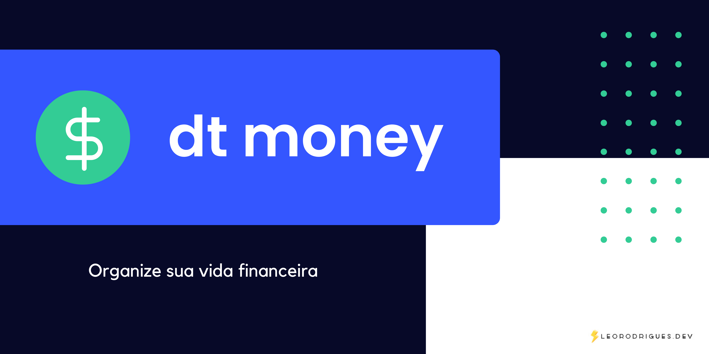
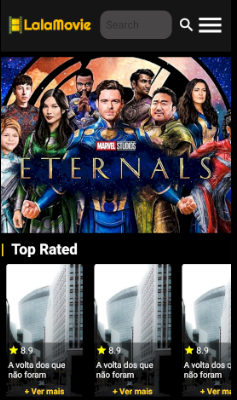
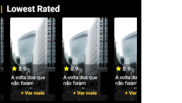

<a alt="README in english language" href="/README-en.md">Click here for README in english language <span>&nbsp;&nbsp; ' </span></a>

<p align="center" >

</p>


<h1 align="center">
     dt money
</h1>
<p align="center">💲 Aplicação para controle pessoal de finanças </p>


\
\
[](https://github.com/)
[](https://code.visualstudio.com/)
[](https://www.typescriptlang.org/)
[](https://www.figma.com/)
[](https://github.com/ellerbrock/open-source-badges/)

<a href="https://pt-br.reactjs.org/"></a>
<a href="https://github.com/onLeoRodrigues/dtmoney/issues"></a>
<a href="https://github.com/onLeoRodrigues/dtmoney/network"></a>
<a href="https://github.com/onLeoRodrigues/dtmoney/stargazers"></a>

Guia
=================
<!--ts-->
   * [Sobre](#Sobre)
   * [Status do Projeto](#Status-do-projeto)
   * [Features](#Features)
   * [Pré-requisitos](#Pre-requisitos)
   * [Rodando a aplicação](#Rodando-a-aplicação)
   * [Tecnologias](#Tecnologias)
   * [Autor](#Autor)
<!--te-->

## Sobre

dt money é um projeto criado para controle de finanças pessoal, onde você encontra recursos como de entrada e daída de dinheiro,organizadas por nome e categoria.
Projeto criado no chapter 1 do IGNITE da Rocketseat.


## Status do Projeto

<h4 align="center"> 
	🚧  dtmoney 🚩 Em construção...  🚧
</h4>

## Features


- [x] Cadastro de entrada/saída
- [x] Calculo de Entrada, Saída e Total
- [ ] Página de login

---
<h1 align="center">
  
  
</h1>


## Pré-requisitos

Antes de começar, você vai precisar ter instalado em sua máquina as seguintes ferramentas:
[Git](https://git-scm.com), [Node.js](https://nodejs.org/en/). 
Além disto é bom ter um editor para trabalhar com o código como [VSCode](https://code.visualstudio.com/)

## 🎲 Rodando a aplicação

```bash
# Clone este repositório
$ git clone https://github.com/onLeoRodrigues/dtmoney.git

# Acesse a pasta do projeto no terminal/cmd
$ cd dtmoney

# Instale as dependências
$ yarn build

# Execute a aplicação em modo de desenvolvimento
$ yarn start

# A aplicação inciará na porta:3000 - acesse http://localhost:3000/
```
## 🛠 Tecnologias

As seguintes ferramentas foram usadas na construção do projeto:

- [Node.js](https://nodejs.org/en/)
- [React](https://pt-br.reactjs.org/)
- [TypeScript](https://www.typescriptlang.org/)
- [Axios](https://axios-http.com/docs/intro)
- [MirageJs](https://miragejs.com/)                       
- [Polished](https://polished.js.org/)
- [Styled Components](https://styled-components.com/)  

## Autor


<a href="https://bio.link/leorodriguesdev">
 
 <br />
 <sub><b>Leonardo Rodrigues</b></sub></a> <a href="https://bio.link/leorodriguesdev" title="link leo">⚡</a>


Feito com ❤️ por Leonardo Rodrigues 👋🏽 Entre em contato!

[](https://twitter.com/leorodriguesdev) [](https://www.linkedin.com/in/on-leorodrigues/) 
[](mailto:leorodriguesoffice@gmail.com)

<p align="left" >

</p>